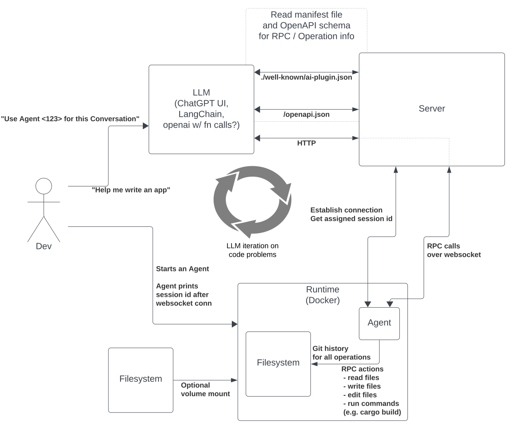

# Carabiner Tech

The goal of Carabiner Tech is to connect AI models with coding environments in a safe and lightweight way. The problem we are trying to solve is allowing the LLM to iterate on problems with real-world feedback so that it can fix syntax mistakes, and work until builds compile or tests pass. In order to do that, we make a limited set of RPC commands available to the LLM while giving Users full control over what runtime those commands are executed in.

One way to think about human-computer interactions is to consider what *artifacts* you are left with after a conversation. At its simplest, that *artifact* is a text chat log. There might be valuable information in that *artifact*, such as code snippets you can copy/paste into an editor to run. With Carabiner, we want the *artifacts* to be a file system and git history of the operations the LLM took to get from the start of the conversation to the end, and we want the LLM to iterate on its own without you the user copy/pasting between Chat UI and your runtime.

# Overview

# Try it out

If you have plugin developer access to ChatGPT, you can try out running our demo server and starting an Agent yourself.

1. Clone this repo, [setup Rust](https://www.rust-lang.org/tools/install) if necessary.
2. Start the demo server: `cd demo-server && cargo run`. It should show it's listening on `127.0.0.1:3000`.
3. In ChatGPT, [enable plugins](https://help.openai.com/en/articles/7183286-how-to-access-plugins), open the plugin store, and choose "develop your own plugin" at the bottom if you have that option (requires plugin developer access).
4. Enter `localhost:3000`, you'll see server logs of ChatGPT pulling the manifest file and openapi schema.
5. Start a conversation with the plugin enabled, perhaps ask it "What can the Carabiner plugin do?"
6. Start an Agent, `cd agent && cargo run`. You'll see the Agent's session id printed out in both Agent and Server logs.
7. Tell ChatGPT "use Agent <session id> for our conversation". You should see ChatGPT perform a `use_agent` operation (POST `/use_agent/:agent_id`).
8. Ask ChatGPT what the system time is on the Agent, or to list files at a directory. Watch what endpoints / operations the LLM chooses to use.
9. Experiment by adding new endpoints to `demo-server/src/api/mod.rs` to support other RPC operations. 

Note the "openai plugin devtools" is very useful to reload your locally-developed plugin here. Otherwise you'll need to uninstall / redevelop the plugin for ChatGPT to pick up changes to your OpenAPI schema.

# Key Crates

 - `tokio` for async runtime in the Agent and Server, `tokio-tungstenite` for the websocket support
 - `poem` / `poem-openapi` for HTTP route handling and OpenAPI schema generation
   - `RpcRequest` variant structs in `rpc/src/operations` derive `poem-openapi::Object` so they can be used as documented POST bodies
 - `config` for building up settings and manifest file with env overrides
 - `serde` for serializing RPC requests over websocket

# RPC

The core functionality of this project, LLMs taking "real world" action and getting feedback that it can iterate with, is done through remote procedure calls (RPC). There are many mature, battle-tested RPC frameworks already out there, such as gRPC / `tonic`. It's important to explain why we rolled our own instead of using an existing solution.

We are implementing "reverse RPC" here. The Agent establishes the websocket connection but acts like the RPC server, handling RPC requests and returning RPC responses. While there are some stack-overflow posts and github issues that address "reverse RPC", we were not able to find full-fledged examples that fit well into our overall Agent and Server stack.

The features we have prioritized in building this new RPC framework are:
 - Clean abstractions for wrapping an RPC Request into a `Message<RpcRequest>` wrapper, which includes going from a request `struct` to an `RpcRequest` enum variant
 - Clean abstractions for deserializing into `Message<RpcResponse>` and calling a `process` function without having to figure out which specific `RpcResponse` variant it is
 - Individual structs to document what the request and response payload structure is, which can also be used as POST bodies for HTTP endpoints and be automatically included in OpenAPI schemas
 - Easy way to write unit tests for each RPC operation `process` functions

We initially tried to use crates such as `enum_dispatch`, `enum_delegate`, and `into_variant` but in the end wrote our own declarative macro to cover the high level abstractions. `define_rpc!` takes a name (str), a request struct, and a response struct, and builds up the `RpcRequest` and `RpcResponse` enums, as well as the `RpcRequest.process` implementation and `From` impls that `enum_dispatch` and `into_variant` provided.

# Coming Soon

 - An unverified and prod plugin you can install in ChatGPT to work with our hosted server
 - Docker containers for various runtimes with the Agent installed
 - Python / Rust libraries for openai function calling that interacts with a Carabiner server
 - Integration with other LLMs